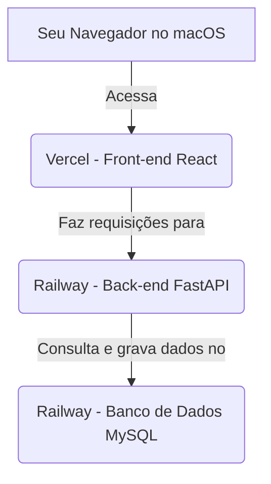

# Guia Completo de Deploy 100% na Nuvem (sem instalação local)

**Projeto:** Sistema de Gestão de Suínos  
**Stack:** GitHub · Railway (MySQL + FastAPI) · Vercel (React)  
**Data:** Janeiro de 2026  
**Elaborado por:** Manus AI

---

## 🎯 Objetivo

Este guia foi criado especialmente para você, que usa macOS e **não quer instalar nada localmente**. Vamos fazer o deploy completo do sistema (banco de dados, back-end e front-end) usando apenas seu navegador e serviços de nuvem gratuitos.

## 🏗️ Arquitetura Final

Nossa aplicação será distribuída em três serviços na nuvem que se comunicam entre si:

| Componente | Plataforma | URL de Exemplo | Custo Estimado |
| :--- | :--- | :--- | :--- |
| **Banco de Dados** | Railway (MySQL) | *Acesso interno* | $0 (Plano Hobby) |
| **Back-end API** | Railway (FastAPI) | `suinos-api.up.railway.app` | $0 (Plano Hobby) |
| **Front-end App** | Vercel (React) | `suinos.vercel.app` | $0 (Plano Hobby) |

**Fluxo de Dados:**



---

## 🛠️ Pré-requisitos (Apenas Contas Online)

1.  **Conta no GitHub:** Essencial para armazenar o código e acionar os deploys automáticos. Crie em [github.com](https://github.com).
2.  **Conta no Railway:** Para o banco de dados e back-end. Crie com sua conta do GitHub em [railway.app](https://railway.app).
3.  **Conta na Vercel:** Para o front-end. Crie com sua conta do GitHub em [vercel.com](https://vercel.com).

---

## 🚀 Passo 1: Subir o Código para o GitHub

Antes de tudo, o código-fonte da aplicação precisa estar em um repositório no seu GitHub. Se você recebeu o projeto como um arquivo ZIP, siga estes passos:

1.  Crie um novo repositório no GitHub (ex: `sistema-gestao-suinos`).
2.  Descompacte o arquivo ZIP.
3.  Use o GitHub Desktop ou comandos `git` para enviar os arquivos para o repositório que você criou.

**Estrutura do Repositório:**

```
sistema-gestao-suinos/
├── fastapi_project/      (Código do Back-end)
│   ├── app/
│   ├── tests/
│   └── requirements.txt
├── frontend/             (Código do Front-end - a ser criado)
│   ├── src/
│   └── package.json
└── README.md
```

---

## 🐘 Passo 2: Criar o Banco de Dados MySQL na Nuvem (Railway)

**Tempo estimado:** 2 minutos

1.  **Acesse o Railway:** [railway.app/dashboard](https://railway.app/dashboard)
2.  Clique em **"New Project"**.
3.  Selecione **"Provision MySQL"**.
4.  **Pronto!** O Railway criará um banco de dados MySQL em segundos.
5.  Clique no novo serviço **"MySQL"**, vá para a aba **"Connect"** e **copie a `DATABASE_URL`**. Guarde-a, pois vamos usá-la em breve.

---

## 🐍 Passo 3: Fazer o Deploy do Back-end FastAPI na Nuvem (Railway)

**Tempo estimado:** 5 minutos

1.  **Dentro do mesmo projeto** no Railway, clique em **"New"** e selecione **"GitHub Repo"**.
2.  Escolha o repositório `sistema-gestao-suinos`.
3.  O Railway irá detectar o código Python e iniciar o deploy.
4.  Vá para a aba **"Variables"** do novo serviço FastAPI e adicione as seguintes variáveis:

    | Nome da Variável | Valor |
    | :--- | :--- |
    | `DATABASE_URL` | Cole a URL do banco de dados que você copiou no passo anterior. |
    | `SECRET_KEY` | Gere uma chave segura (pode usar um gerador de senhas online) e cole aqui. |
    | `ALGORITHM` | `HS256` |
    | `ACCESS_TOKEN_EXPIRE_MINUTES` | `30` |

5.  Vá para a aba **"Settings"** e configure:
    -   **Root Directory:** `fastapi_project` (se o código estiver em uma subpasta).
    -   **Build Command:** `pip install -r requirements.txt`
    -   **Start Command:** `uvicorn app.main:app --host 0.0.0.0 --port $PORT`

6.  Ainda em **"Settings"**, na seção **"Networking"**, clique em **"Generate Domain"** para obter a URL pública da sua API (ex: `suinos-api.up.railway.app`).

**Verificação:** Acesse a URL gerada e adicione `/docs` ao final. Você deve ver a documentação interativa do Swagger. Isso confirma que sua API está online e funcionando.

---

## ⚛️ Passo 4: Fazer o Deploy do Front-end React na Nuvem (Vercel)

**Tempo estimado:** 5 minutos

1.  **Acesse a Vercel:** [vercel.com/dashboard](https://vercel.com/dashboard)
2.  Clique em **"Add New..."** → **"Project"**.
3.  Selecione o mesmo repositório `sistema-gestao-suinos` do GitHub.
4.  A Vercel detectará o projeto React. Configure o seguinte:
    -   **Framework Preset:** `Create React App` (deve ser automático).
    -   **Root Directory:** `frontend` (aponte para a pasta do seu front-end).

5.  Expanda a seção **"Environment Variables"** e adicione:

    | Nome da Variável | Valor |
    | :--- | :--- |
    | `REACT_APP_API_URL` | Cole a URL da sua API no Railway (ex: `https://suinos-api.up.railway.app/api/v1`) |

6.  Clique em **"Deploy"**.

**Verificação:** A Vercel irá compilar e publicar seu site. Ao final, você receberá uma URL pública (ex: `suinos.vercel.app`). Acesse-a e teste as funcionalidades. Se você conseguir cadastrar um animal, significa que o front-end está se comunicando com o back-end, que por sua vez está se comunicando com o banco de dados. **Tudo 100% na nuvem!**

---

## 🔄 Fluxo de Trabalho Contínuo (CI/CD)

A mágica desta abordagem é o **deploy automático**. A partir de agora:

-   Sempre que você fizer um `git push` com alterações na pasta `fastapi_project`, o **Railway** irá automaticamente fazer o deploy de uma nova versão do seu back-end.
-   Sempre que você fizer um `git push` com alterações na pasta `frontend`, a **Vercel** irá automaticamente fazer o deploy de uma nova versão do seu front-end.

Você só precisa se preocupar em programar e enviar o código para o GitHub. O resto é automático.

---

## 🔗 Configurando um Domínio Personalizado (Opcional)

Para ter um endereço mais profissional (ex: `www.granjasuinos.com.br`), siga estes passos:

1.  **Compre um domínio:** Use serviços como [GoDaddy](https://www.godaddy.com) ou [Namecheap](https://www.namecheap.com).
2.  **Configure na Vercel:** No seu projeto na Vercel, vá para a aba **"Domains"**, adicione seu domínio e siga as instruções para configurar os registros DNS no painel do seu provedor de domínio.
3.  **Configure um subdomínio para a API:** No painel do seu provedor de domínio, crie um registro `CNAME` chamado `api` que aponte para a URL da sua API no Railway (`suinos-api.up.railway.app`). Em seguida, adicione `api.granjasuinos.com.br` como um domínio personalizado no seu serviço FastAPI no Railway.

---

## ✅ Checklist Final

- [ ] Código-fonte no GitHub.
- [ ] Conta criada no Railway.
- [ ] Conta criada na Vercel.
- [ ] Banco de Dados MySQL provisionado no Railway.
- [ ] Back-end FastAPI fazendo deploy no Railway.
- [ ] Variáveis de ambiente do back-end configuradas.
- [ ] Front-end React fazendo deploy na Vercel.
- [ ] Variável de ambiente do front-end configurada.
- [ ] Aplicação completa funcionando online.

Parabéns! Seu sistema está totalmente online, sem que você precisasse instalar nada em seu Mac. 🎉
